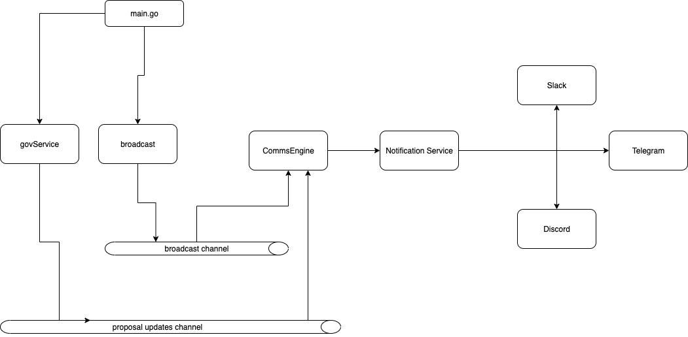

# ZetaComms

ZetaComms is a notification service for ZetaChain governance proposals. It monitors proposals on different networks and sends notifications to various communication channels including Slack, Discord, and Telegram.




## Features

- Monitor ZetaChain governance proposals across multiple networks (mainnet, testnet etc)
- Send notifications for filtered messages to multiple channels:
  - Slack (via webhooks)
  - Discord (via bot)
  - Telegram (via bot)
- Broadcast messages to all configured audiences via Telegram
- Configurable audiences and notification channels

## Installation

```bash
# Clone the repository
git clone https://github.com/hazim1093/zeta-comms.git
cd zeta-comms

# Install dependencies
go mod download

# Build the application
go build -o zeta-comms
```

## Configuration

A sample configuration file is provided at `configs/config.yaml`. You can modify this file or provide additional configuration files using the `--config` flag.

### Environment Variables

The following environment variables are used for sensitive information:

```bash
# Required for Discord notifications
export DISCORD_BOT_TOKEN="your-discord-bot-token"

# Required for Telegram notifications
export TELEGRAM_BOT_TOKEN="your-telegram-bot-token"


export SLACK_TESTNET_WEBHOOK="your-slack-webhook"
export SLACK_MAINNET_WEBHOOK="your-slack-webhook"
```

### Setting Up Notification Channels

- For Telegram setup instructions, see [telegram-bot.md](./docs/telegram-bot.md)
- For Discord setup instructions, see [discord-bot.md](./docs/discord-bot.md)
- For Slack, you only need to create a webhook URL in your Slack workspace

## Usage

```bash
# Run with default configuration
./zeta-comms

# Run with additional configuration file
./zeta-comms --config additional-config.yaml
```

### Broadcasting Messages

You can broadcast messages to all configured audiences using the Telegram bot:

1. Add your bot to a Telegram group or direct message
2. Send a message with the format: `/broadcast Your message here`
3. The message will be sent to all configured audiences across all channels

## Project Structure

- `configs/`: Configuration files
- `docs/`: Documentation for setting up notification channels
- `internal/`: Internal packages (comms, config, events, notifications, storage)
- `pkg/`: Public packages (models, notifiers, zetachain)

## Development

### Adding a New Notification Channel

1. Create a new package in `pkg/notifiers/` for the channel
2. Implement the `notifiers.Notifier` interface
3. Create a message formatter for the channel
4. Update the `NotificationService` in `internal/notifications/notifications.go`
5. Update the configuration structure in `internal/config/config.go`
